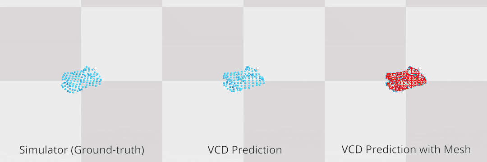

<h1> Learning Visible Connectivity Dynamics for Cloth Smoothing</h1>

Xingyu Lin*, Yufei Wang*, Zixuan Huang, David Held, CoRL 2021. `*` indicates equal contribution (order by dice rolling).

[Website](https://sites.google.com/view/vcd-cloth/home) /  [ArXiv](https://arxiv.org/pdf/2105.10389.pdf) 

# Table of Contents
- 1 [Simulation](#simulation)
    - 1.1 [Setup](#setup)
    - 1.2 [Train VCD](#train-vcd)
    - 1.3 [Planning with VCD](#plan-vcd)
    - 1.4 [Graph Imitation Learning](#graph-imit)
    - 1.5 [Pretrained Models](#pretrained)
    - 1.6 [Demo](#Demo)
----
# Simulation

## Setup
This repository is a subset of [SoftAgent](https://github.com/Xingyu-Lin/softagent) cleaned up for VCD. Environment setup for VCD is similar to that of softagent.
1. Install [SoftGym](https://github.com/Xingyu-Lin/softgym). Then, copy softgym as a submodule in this directory by running `cp -r [path to softgym] ./`. Use the updated softgym on the vcd branch by `cd softgym && git checkout vcd`
2. You should have a conda environment named `softgym`. Install additional packages required by VCD, by `conda env update --file environment.yml` 
3. Generate initial environment configurations and cache them, by running `python VCD/generate_cached_initial_state.py`.
4. Run `./compile_1.0.sh && . ./prepare_1.0.sh` to compile PyFleX and prepare other paths.

## Train VCD
* Generate the dataset for training by running
    ```
    python VCD/main.py --gen_data=1 --dataf=./data/vcd
    ```
  Please refer to `main.py` for argument options.

* Train the dynamics model by running
    ```
    python VCD/main.py --gen_data=0 --dataf=./data/vcd_dyn
    ```
* Train the EdgeGNN model by running
    ```
    python VCD/main_train_edge.py --gen_data=0 --dataf=./data/vcd_edge
    ```
## Planning with VCD
```
python VCD/main_plan.py --edge_model_path={path_to_trained_edge_model}\
                        --partial_dyn_path={path_to_trained_dynamics_model}
```
An example for loading the model trained for 120 epochs:
```
python VCD/main_plan.py --edge_model_path=./data/vcd_edge/vsbl_edge_120.pth\
                        --partial_dyn_path=./data/vcd_dyn/vsbl_dyn_120.pth
```
## Graph Imitation Learning
1. Train dynamics using the full mesh
```
python VCD/main.py --gen_data=0 --dataf=./data/vcd --train_mode=full
```
2. Train dynamics using partial point cloud and imitate the teacher model
```
python VCD/main.py --gen_data=0 --dataf=./data/vcd --train_mode=graph_imit --full_dyn_path={path_to_teacher_model}
```

## Pretrained Model
Please refer to [this page](pretrained/README.md) for downloading the pretrained models.

## Demo
* Dynamics rollout  
  
* Planning on square cloth  
  
## Cite
If you find this codebase useful in your research, please consider citing:
```
@inproceedings{lin2022learning,
  title={Learning visible connectivity dynamics for cloth smoothing},
  author={Lin, Xingyu and Wang, Yufei and Huang, Zixuan and Held, David},
  booktitle={Conference on Robot Learning},
  pages={256--266},
  year={2022},
  organization={PMLR}
}

@inproceedings{corl2020softgym,
 title={SoftGym: Benchmarking Deep Reinforcement Learning for Deformable Object Manipulation},
 author={Lin, Xingyu and Wang, Yufei and Olkin, Jake and Held, David},
 booktitle={Conference on Robot Learning},
 year={2020}
}
```
